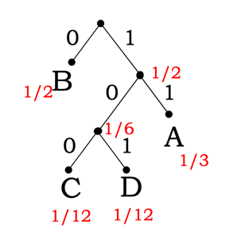
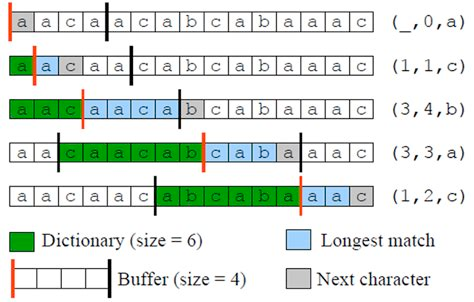
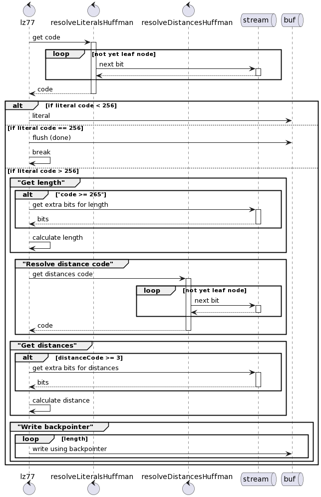

# gzip.go

Largely derived from http://www.infinitepartitions.com/art001.html
  
## Technique 1: Huffman Encoding

It's one instance of optimal encoding system.

What is encoding? Encoding is mapping from **symbols** to another **symbols**. 
In this case we will map the symbol to binary values, which we will simply call as **codes**.
It is important that the encoded result must be decode-able. Some (invalid) mapping can cause the encoded data to be undecode-able because of ambiguity.

### Basic example

One example of encoding, is let say, encode the 4 shapes of a card set, as such:

| Shape     | Code |
|-----------|------|
| `club`    | 00   |
| `heart`   | 01   |
| `spade`   | 10   |
| `diamond` | 11   |

`club`, `heart`, `spade`, and `diamond` into some binary values, for example, `00`, `01`, `10`, `11`. In this way, a string of codes like `01101111` can be decoded as `heart`, `spade`, `diamond`, `diamond`.

In this particular encoding, we are using `2 bits` for each symbol, hence the **average length** of the codes are `2 bits` as well.

### Encoding Performance

In most cases, the main goal of an encoding system is to **reduce space**. That is equivalent to minimizing the **average length**. An example of a very redundant encoding system is to encode the symbols as ASCII characters, simply like mapping:

| Shape     | Code      |
|-----------|-----------|
| `club`    | `club`    |
| `heart`   | `heart`   |
| `spade`   | `spade`   |
| `diamond` | `diamond` |

In this case, the **average length** is `(4 + 5 + 5 + 7)bytes/4 = 5.25 bytes = 42 bits`. This is 21 times longer than our previous 2-bits encoding.

Can we do better than 2-bits? How about this following encoding?

### Invalid encoding and lower-bound of information

| Shape     | Code |
|-----------|------|
| `club`    | 0    |
| `heart`   | 1    |
| `spade`   | 00   |
| `diamond` | 01   |

Assuming that all shape has equal frequency of appearance, this encoding has an average length of 1.5 bits.

However, there is an issue with this encoding. When we encounter the code `00`, we don't know if it should mean 2 `club`s or 1 `spade`. So we call this invalid encoding.

So seems like the `2 bits` encoding is the best one for now. But how do we know or how do we prove it? We can have another valid encoding that is not of equal length, or which we can call "variable length encoding", for example:

| Shape     | Code |
|-----------|------|
| `club`    | 1    |
| `heart`   | 01   |
| `spade`   | 001  |
| `diamond` | 0001 |

This doesn't have ambiguity in the decoding state, but the average bit length is 2.5.

But all this while we only talk in the assumption of the frequency being equal. Assume we have a different card sets that has different frequency of shapes:

| Shape     | Frequency |
|-----------|-----------|
| `club`    | 0.5       |
| `heart`   | 0.3       |
| `spade`   | 0.1       |
| `diamond` | 0.1       |

In this case, to measure the encoding performance, we cannot simply take the average bit length, but rather we need to weight it against the frequency.

| Shape     | Frequency | Fixed Length Enc | Contribution |
|-----------|-----------|------------------|--------------|
| `club`    | 0.5       | `00`             | 1 bit        |
| `heart`   | 0.3       | `01`             | 0.6 bit      |
| `spade`   | 0.1       | `10`             | 0.2 bit      |
| `diamond` | 0.1       | `11`             | 0.2 bit      |

*Because we are talking in terms of expectation / frequency, we can use non-integer value for "bit count" despite bit being a discrete measure. 

Here, the fixed-length 2-bit encoding uses about (1 + 0.6 + 0.2 + 0.2) = 2 bits per symbol (following the symbol frequency/distribution). This is not very surprising because regardless of the frequency distribution, each symbol contributes the same amount.

Let's compare it with our variable length encoding:

| Shape     | Frequency | Variable Length Enc | Contribution |
|-----------|-----------|---------------------|--------------|
| `club`    | 0.5       | `1`                 | 0.5 bit      |
| `heart`   | 0.3       | `01`                | 0.6 bit      |
| `spade`   | 0.1       | `001`               | 0.3 bit      |
| `diamond` | 0.1       | `0001`              | 0.4 bit      |

Here, the sum of contribution is 1.8 bits.

In fact, we can make the encoding shorter:

| Shape     | Frequency | Variable Length Enc | Contribution |
|-----------|-----------|---------------------|--------------|
| `club`    | 0.5       | `1`                 | 0.5 bit      |
| `heart`   | 0.3       | `01`                | 0.6 bit      |
| `spade`   | 0.1       | `001`               | 0.3 bit      |
| `diamond` | 0.1       | `000`               | 0.3 bit      |

This encoding might be slightly less intuitive, but consider streams like `000010010001` can be decoded easily as:

- `000`
- `01`
- `001`
- `000`
- `1`

This encoding has the total contribution of 1.7 bits per symbol. It can be proven that this encoding is the most optimal one for such frequency distribution. 

### Huffman Algorithm

Huffman Algorithm is an algorithm to generate huffman encoding. Huffman Algorithm works on the distribution of the symbols and will generate an optimal* encoding for the set of symbols. 

*this method is only optimal for if we want to encode one symbol at a time (can be proven). If we remove that constraint and we can encode strings of symbols instead, we can do better compression (lower average bits per symbol).

Algorithm:
0. Given `n` symbols with probability/frequency of `p_0`, `p_1`, ..., `p_n`
1. Build subtree using 2 symbols with the lowest `p_i`.
2. At each step, choose 2 symbols/subtrees with the lowest total probability/frequency, combine to form new subtree
3. Result: optimal tree built with bottom-up
4. Apply `0` to left edge and `1` to right edge (or vice versa, doesn't matter)

Example:

| Shape | Frequency |
|-------|-----------|
| `A`   | 1/3       |
| `B`   | 1/2       |
| `C`   | 1/12      |
| `D`   | 1/12      |



Thus, we will get encoding of:

| Shape | Encoding |
|-------|----------|
| `A`   | `11`     |
| `B`   | `0`      |
| `C`   | `100`    |
| `D`   | `101`    |

------------

Read more: https://computationstructures.org/lectures/info/info.html (Entropy, Huffman Algorithm)


## Huffman Trees Encoding

So far we have only discussed huffman trees in the abstract or in your program's memory. How do we actually encode this? The naivest solution will simply be listing out the symbol and encoding one after another:

| Symbol | Encoding |
|--------|----------|
| `A`    | `11`     |
| `B`    | `0`      |
| `C`    | `100`    |
| `D`    | `101`    |

But this is not very efficient. One improvement that we can do is to skip listing out the symbol instead because we can pre-agree on what are the symbols are.

| Encoding |
|----------|
| `11`     |
| `0`      |
| `100`    |
| `101`    |

Next thing that we can improve, is actually we don't have to provide all the encoding, simply giving the bitlength is enough to build a reproducible tree. **This is possible because what really matters in huffman tree is the length for each symbol encoding, not the structure of the tree itself.**

| Encoding |
|----------|
| 2        |
| 1        |
| 3        |
| 3        |

Here's one way to fill it

``` text
  0000: 0
  0001: 1
101100: 2 <- start a new sequence at (10101 + 1) << 1
101101: 3
101110: 4
  0010: 5 <- pick up four-bit sequence where it left off
  0011: 6
 01110: 7 <- start a new sequence at (0110 + 1) << 1
 01111: 8
 10000: 9
 10001: 10
 10010: 11
 10011: 12
 10100: 13
 10101: 14
101111: 15 <- pick up six-bit sequence where it left off
110000: 16
110001: 17
110010: 18
  0100: 19 <- pick up four-bit sequence where it left off
  0101: 20
  0110: 21
110011: 22 <- pick up six-bit sequence where it left off
110100: 23
110101: 24
110110: 25
110111: 26
```

The next step is to, instead of providing all the bit lengths, we can provide it as RLE instead:

``` go
func TestRLE(t *testing.T) {
	values := []int{
		3, 0, 0, 0, 4, // 0-4
		4, 3, 2, 3, 3, // 5-9
		4, 5, 0, 0, 0, // 10-14
		0, 6, 7, 7, // 15-18
	}
	expectedRanges := []rleRange{
		{0, 3},
		{3, 0},
		{5, 4},
		{6, 3},
		{7, 2},
		{9, 3},
		{10, 4},
		{11, 5},
		{15, 0},
		{16, 6},
		{18, 7},
	}
	assert.Equal(t, expectedRanges, runLengthEncoding(values))
}
```

If you are worried about RLE having more overhead than the benefit, note that we have about 285 codes in total in GZIP, which probably will have bit lengths of up to 10. We should have more consecutive values, especially where there's a lot of 0s.

The actual RLE system used in GZIP:

``` go
for i < alphabetCount {
    code, _ := getCode(stream, codeLengthsRoot)
    // 0-15: literal (4 bits)
    // 16: repeat the previous character n times
    // 17: insert n 0's (3 bit specified), max value is 10
    // 18: insert n 0's (7 bit specifier), add 11 (because it's the max of code 17)
    if code == 16 {
        repeatLength := readBitsInv(stream, 2) + 3
        for j := 0; j < repeatLength; j++ {
            alphabetBitLengths[i] = alphabetBitLengths[i-1]
            i++
        }
    } else if code == 17 || code == 18 {
        var repeatLength int
        if code == 17 {
            repeatLength = readBitsInv(stream, 3) + 3
        } else {
            repeatLength = readBitsInv(stream, 7) + 11
        }
        for j := 0; j < repeatLength; j++ {
            alphabetBitLengths[i] = 0
            i++
        }
    } else {
        alphabetBitLengths[i] = code
        i++
    }
}
```

## Technique 2: LZ77

LZ77 is a data compression algorithm published by Lempel and Ziv in 1977 (not to be confused with LZ78, which is similar but slightly different). In principle, LZ77 maintains a sliding window where we can reference some earlier data in the sliding window.

One implementation could be to have triplets of data: `(back pointer, copy-length, next_byte)` as such:



Notice the triplet like `(3, 4, b)`, the string `aaca` is a self-reference. (the last `a` in the blue box refers to first `a` in the blue box). This always happens when `copy-length` is bigger than `back-pointer`.

The actual LZ77 implementation used in GZIP slightly more complicated for more efficient use of space. But we can discuss it later.


## LZ77 in GZIP

Consider we have this body of text (char count 1408 chars)

```
So shaken as we are, so wan with care,
Find we a time for frighted peace to pant,
And breathe short-winded accents of new broils
To be commenced in strands afar remote.
No more the thirsty entrance of this soil
Shall daub her lips with her own children's blood;
Nor more shall trenching war channel her fields,
Nor bruise her flowerets with the armed hoofs
Of hostile paces: those opposed eyes,
Which, like the meteors of a troubled heaven,
All of one nature, of one substance bred,
Did lately meet in the intestine shock
And furious close of civil butchery
Shall now, in mutual well-beseeming ranks,
March all one way and be no more opposed
Against acquaintance, kindred and allies:
The edge of war, like an ill-sheathed knife,
No more shall cut his master. Therefore, friends,
As far as to the sepulchre of Christ,
Whose soldier now, under whose blessed cross
We are impressed and engaged to fight,
Forthwith a power of English shall we levy;
Whose arms were moulded in their mothers' womb
To chase these pagans in those holy fields
Over whose acres walk'd those blessed feet
Which fourteen hundred years ago were nail'd
For our advantage on the bitter cross.
But this our purpose now is twelve month old,
And bootless 'tis to tell you we will go:
Therefore we meet not now. Then let me hear
Of you, my gentle cousin Westmoreland,
What yesternight our council did decree
In forwarding this dear expedience.
```

After applying LZ77:
```
So shaken as we are, so wan with c<16,4>(are,)
Find<12,5>( we a) time for frighted peace to pant,
A<41,3>(nd )breathe<2,3>( sh)ort-w<40,3>(ind)<64,3>(ed )accents of new<85,3>( br)oils
To be commenc<104,3>(ed )in strands afar remote.
No mor<71,3>(e t)h<175,4>(e th)irsty <110,3>(ent)<150,3>(ran)<70,3>(ce )<115,3>(of )<181,3>(thi)s<20,3>( so)il
Shall daub her lips<27,6>( with )<222,4>(her )own children's blood;<168,3>(
No)r<171,6>( more )s<212,5>(hall )t<249,3>(ren)<244,3>(chi)ng<23,3>( wa)r<243,3>( ch)annel<235,5>( her )fields,<261,5>(
Nor )bruise<298,6>( her f)loweret<229,7>(s with )<177,4>(the )arm<142,3>(ed )hoofs
Of<350,3>( ho)stile<75,3>( pa)ces:<340,3>( th)o<319,3>(se )opp<377,3>(ose)d eye<308,3>(s,
)Which,<225,3>( li)k<175,6>(e the )meteor<113,5>(s of )<47,3>(a t)roubl<348,4>(ed h)eaven<80,3>(,
A)<274,3>(ll )<419,3>(of )one natu<17,4>(re, )<445,7>(of one )subst<193,5>(ance )<86,3>(bre)d,
Did lately<410,3>( me)et<144,4>( in )<407,4>(the )inte<362,3>(sti)n<92,5>(e sho)ck<81,5>(
And )furious cl<377,5>(ose o)f civil butc<322,3>(her)y<210,7>(
Shall )now,<498,4>( in )mutual<43,3>( we)ll-beseem<283,4>(ing )<192,3>(ran)k<392,3>(s,
)March <560,4>(all )<463,4>(one )way a<83,4>(nd b)<450,3>(e n)<170,7>(o more )<381,7>(opposed)
Against<106,3>( ac)qu<644,3>(ain)<471,5>(tance), k<101,3>(ind)r<104,4>(ed a)<620,3>(nd )<607,3>(all)i<371,3>(es:)
T<503,3>(he )edg<538,5>(e of )<287,3>(war)<400,7>(, like )<25,3>(an )i<581,3>(ll-)sh<88,5>(eathe)d knife,<168,9>(
No more )<271,6>(shall )cut <202,4>(his )master. <684,3>(The)re<54,3>(for)<661,3>(e, )<58,3>(fri)en<307,4>(ds,
)As <157,4>(far )<10,3>(as )<73,3>(to )<90,5>(the s)epulchr<691,5>(e of )Christ<393,4>(,
Wh)<536,4>(ose )soldi<323,3>(er )<564,5>(now, )u<102,3>(nde)r w<818,5>(hose )<428,3>(ble)s<385,4>(sed )cross
W<14,5>(e are) impr<850,6>(essed )<672,4>(and )engag<876,3>(ed )<789,3>(to )f<60,4>(ight)<37,3>(,
F)<96,3>(ort)h<336,5>(with )a p<328,4>(ower)<805,4>( of )English<736,7>( shall )<44,3>(we )levy;<816,7>(
Whose )<345,3>(arm)<11,4>(s we)<866,3>(re )mould<142,6>(ed in )<792,3>(the)i<264,4>(r mo)<972,3>(the)rs' womb<128,4>(
To )<291,3>(cha)s<405,5>(e the)s<366,4>(e pa)gans<968,6>( in th)<947,4>(ose )ho<491,3>(ly )<303,6>(fields)
Ov<839,9>(er whose )ac<872,3>(res)<695,3>( wa)lk'd<1016,7>( those )<848,8>(blessed )f<495,3>(eet)<394,6>(
Which)<53,3>( fo)urte<7,3>(en )hu<666,6>(ndred )yea<416,3>(rs )ago<955,6>( were )nail'd<900,4>(
For) <1085,3>(our) adv<77,3>(ant)a<690,4>(ge o)<500,6>(n the )bit<754,3>(ter)<855,6>( cross).
B<744,3>(ut )<201,5>(this )<1127,4>(our )pur<636,4>(pose)<830,4>( now) <1168,3>(is )t<579,3>(wel)v<959,4>(e mo)n<908,3>(th )<824,3>(old)<80,7>(,
And b)oot<1066,4>(less) 'ti<787,6>(s to t)<580,3>(ell) you<935,4>( we )w<709,3>(ill) go<682,5>(:
The)<762,6>(refore)<1237,4>( we )<494,5>(meet )no<1266,4>(t no)w<757,5>(. The)n<938,3>( le)t<1262,3>( me)<432,4>( hea)r<356,4>(
Of )<1234,3>(you), my g<189,3>(ent)l<133,4>(e co)us<1014,3>(in )W<509,3>(est)<732,4>(more)l<879,3>(and)<815,4>(,
Wh)at<1100,3>( ye)<753,4>(ster)n<895,4>(ight)<1170,5>( our )<1312,3>(cou)nc<546,3>(il )d<484,3>(id )de<1047,3>(cre)e
In<53,4>( for)<696,3>(war)d<590,4>(ing )<1166,5>(this )d<1290,3>(ear) expe<826,3>(die)<659,3>(nce).

Summary Report: literalCount 599, backPointerCount 202, totalBytes 1408
```

We can get reduce the space usage until only 42.5% of the original space (ignoring all the overhead first for now). The actual space usage maybe around 50-60% of original.

But how do we actually encode back pointer? One naive solution is to use escape characters to differentiate the metadata (back-pointer) from the literals. However this might not have good performance. In GZIP, actually we don't even store the literals as literal, however, as **huffman code!**

Here's a simplified snippet from the implementation:

``` go
for {
    node := resolveHuffmanCode(literalsRoot, stream)
    if node.code >= 0 && node.code < 256 {
        // literal
        buf = append(buf, byte(node.code))
    } else if node.code == 256 {
        // stop code
        break
    } else if node.code > 256 && node.code <= 285 {
        // This is a back-pointer

        // get length
        var length int
        if node.code < 265 {
            length = node.code - 254
        } else {
            length = getExtraLength(length, stream)
        }

        // get distance (from huffman tree)
        distNode := resolveHuffmanCode(distancesRoot, stream)
        dist := dist.code 
        if dist > 3 {
            dist = getExtraDist(dist, stream)
        }

        // read backpointer
        backPointer := len(buf) - dist - 1
        for length > 0 {
            buf = append(buf, buf[backPointer])
            length--
            backPointer++
        }
    } else {
        panic("invalid code!")
    }
}
```

If you notice here there are two huffman trees being used: `literalsTree` and `distancesTree`. We will discuss about the construction of the tree later. Here is flow of data:

``` plantuml
control lz77 as outer
control resolveLiteralsHuffman
control resolveDistancesHuffman
queue stream
queue buf

outer -> resolveLiteralsHuffman++: get code
loop not yet leaf node
  resolveLiteralsHuffman -> stream++: next bit
  resolveLiteralsHuffman <-- stream--
end
outer <-- resolveLiteralsHuffman--: code

alt if literal code < 256
  outer -> buf: literal


else if literal code == 256
  outer -> buf: flush (done)
  outer -> outer: break


else if literal code > 256
  group "Get length"
    alt "code >= 265"
      outer -> stream++: get extra bits for length
      outer <-- stream--: bits
    end
    outer -> outer: calculate length
  end
  
  group "Resolve distance code"
    outer -> resolveDistancesHuffman++: get distances code
    loop not yet leaf node
      resolveDistancesHuffman -> stream++: next bit
      resolveDistancesHuffman <-- stream--
    end
    outer <-- resolveDistancesHuffman--: code
  end
  
  group "Get distances"
    alt distanceCode >= 3
      outer -> stream++: get extra bits for distances
      outer <-- stream--: bits
    end
    outer -> outer: calculate distance
  end
  
  group "Write backpointer"
    loop length
      outer -> buf: write using backpointer
    end
  end
end
```


